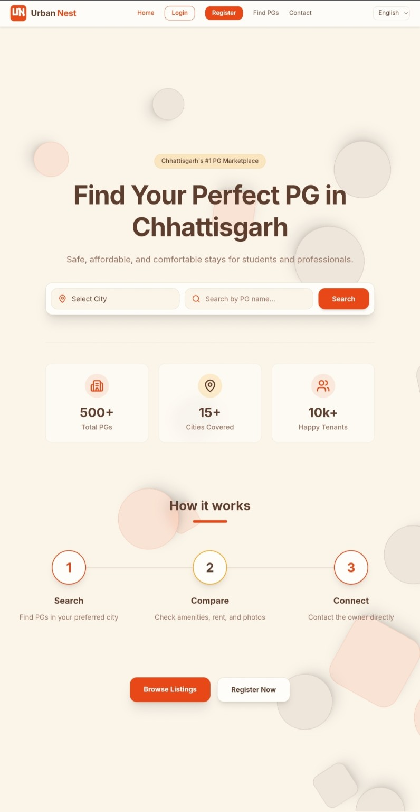
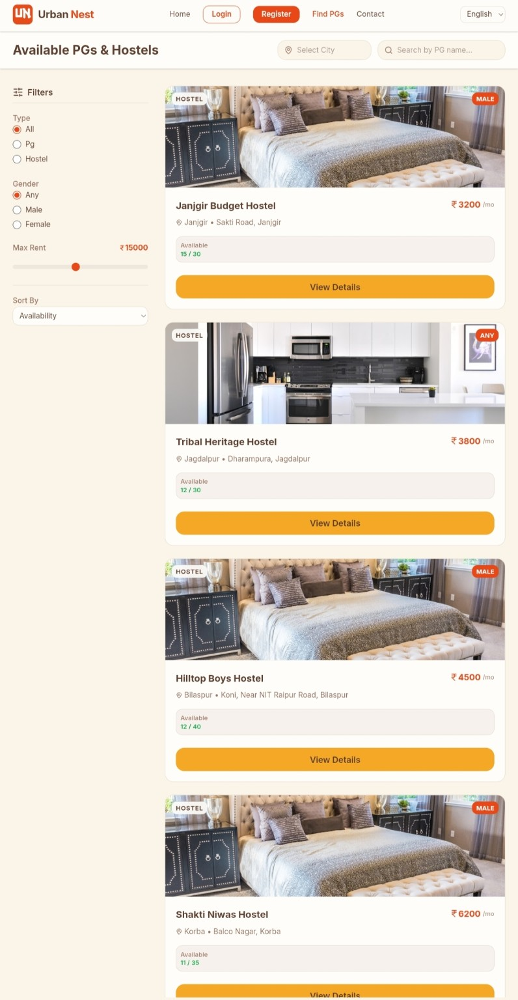
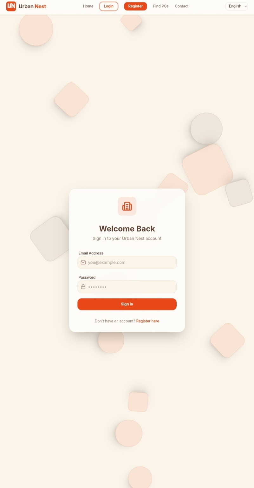
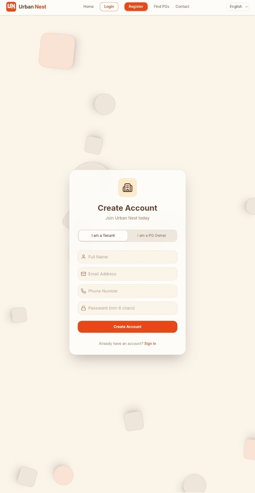
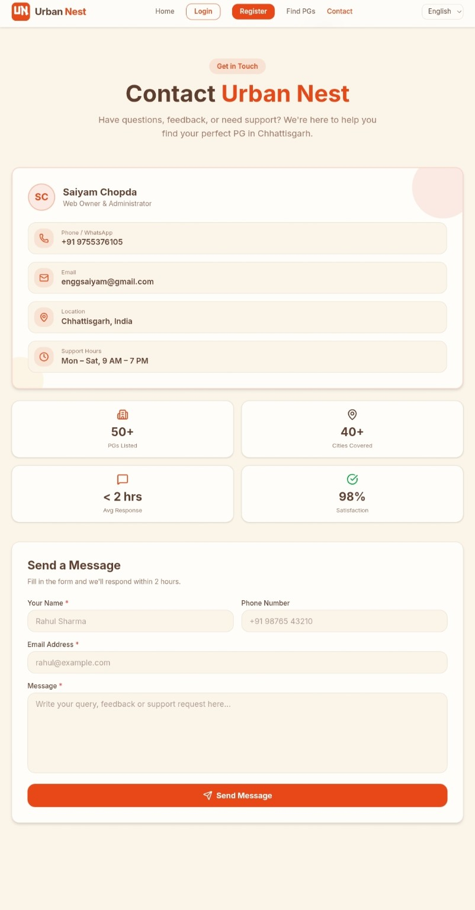

# 🏠 Urban Nest – PG Finder for Chhattisgarh

> **A modern full-stack PG & Hostel Finder platform built to simplify accommodation discovery across Chhattisgarh.**


Urban Nest is a modern full-stack PG & Hostel Finder platform that helps students and working professionals discover verified accommodations across Chhattisgarh with advanced search, secure authentication, multilingual support, and dedicated dashboards for tenants and property owners.

---

# ✨ Features

- 🔍 Smart PG & Hostel Search
- 🏠 Browse Verified Listings
- 👨‍🎓 Tenant Dashboard
- 👨‍💼 PG Owner Dashboard
- 📝 List Your PG
- 📷 Multiple Image Upload
- 💰 Rent Range Filters
- ⚧ Gender Based Filtering
- 🌐 Multi-language Support
- 🔐 Secure Authentication
- 📱 Fully Responsive Design
- 📞 Contact & Complaint System
- 🎨 Modern UI with Animations

---

# 🛠 Tech Stack

| Category | Technology |
|----------|------------|
| Frontend | React.js + Vite + TypeScript |
| Styling | Tailwind CSS + Framer Motion |
| Backend | Node.js + Express.js |
| Database | PostgreSQL / MySQL |
| Authentication | Custom HMAC Token |
| API | OpenAPI 3.1 |
| Internationalization | React Context |

---

# 🎨 Color Palette

| Name | Hex |
|------|------|
| Magma Orange | `#E84B1A` |
| Sunrise Orange | `#F5A623` |
| Oak Wood Brown | `#5C3D2E` |
| Cream Background | `#FDF6EC` |

---

# 📸 Screenshots

> Add your screenshots inside a **screenshots/** folder.

## Home



## PG Listings



## Login



## Register



## Dashboard


## Contact



---

# 📂 Project Structure

```
urban-nest/
│
├── backend/
│   ├── src/
│   ├── routes/
│   ├── middlewares/
│   ├── controllers/
│   └── package.json
│
├── frontend/
│   ├── src/
│   ├── components/
│   ├── pages/
│   ├── contexts/
│   └── package.json
│
├── mysql/
│   ├── schema.sql
│   └── seed.sql
│
├── screenshots/
├── README.md
└── LICENSE
```

---

# 🚀 Installation

## Clone Repository

```bash
git clone https://github.com/enggSaiyam/Urban-Nest---PG-Finder-Chhattisgarh.git

cd Urban-Nest---PG-Finder-Chhattisgarh
```

## Backend

```bash
cd backend
npm install
npm run dev
```

## Frontend

```bash
cd frontend
npm install
npm run dev
```

Visit:

```
http://localhost:5173
```

---

# 🔑 Demo Accounts

| Role | Email | Password |
|------|-------|----------|
| Tenant | tenant@demo.com | password123 |
| Owner | owner@demo.com | password123 |

---

# 📡 API Endpoints

| Method | Endpoint | Description |
|--------|----------|-------------|
| POST | /api/auth/register | Register User |
| POST | /api/auth/login | Login |
| GET | /api/auth/me | Current User |
| GET | /api/cities | All Cities |
| GET | /api/pgs | Get Listings |
| POST | /api/pgs | Add PG |
| GET | /api/pgs/:id | PG Details |
| PUT | /api/pgs/:id | Update PG |
| DELETE | /api/pgs/:id | Delete PG |
| GET | /api/dashboard/tenant | Tenant Dashboard |
| GET | /api/dashboard/owner | Owner Dashboard |
| GET | /api/complaints | Complaints |
| POST | /api/complaints | Submit Complaint |

---

# 🌍 Supported Languages

- 🇬🇧 English
- 🇮🇳 हिन्दी
- 🇧🇩 বাংলা
- 🇮🇳 தமிழ்
- 🇮🇳 తెలుగు
- 🇮🇳 ਪੰਜਾਬੀ

---

# 🚀 Future Improvements

- 🗺 Google Maps Integration
- 💳 Online Booking & Payments
- 🤖 AI Based PG Recommendation
- ⭐ Ratings & Reviews
- 💬 Live Chat
- 📍 Location Based Search
- ❤️ Wishlist Feature

---

# 👨‍💻 Developer

**Saiyam Chopda**

📧 Email: enggsaiyam@gmail.com

📱 Phone: +91 9755376105

---

# 📄 License

This project is licensed under the **MIT License**.

---

# ⭐ Support

If you like this project, consider giving it a ⭐ on GitHub.

It motivates future development and improvements.
